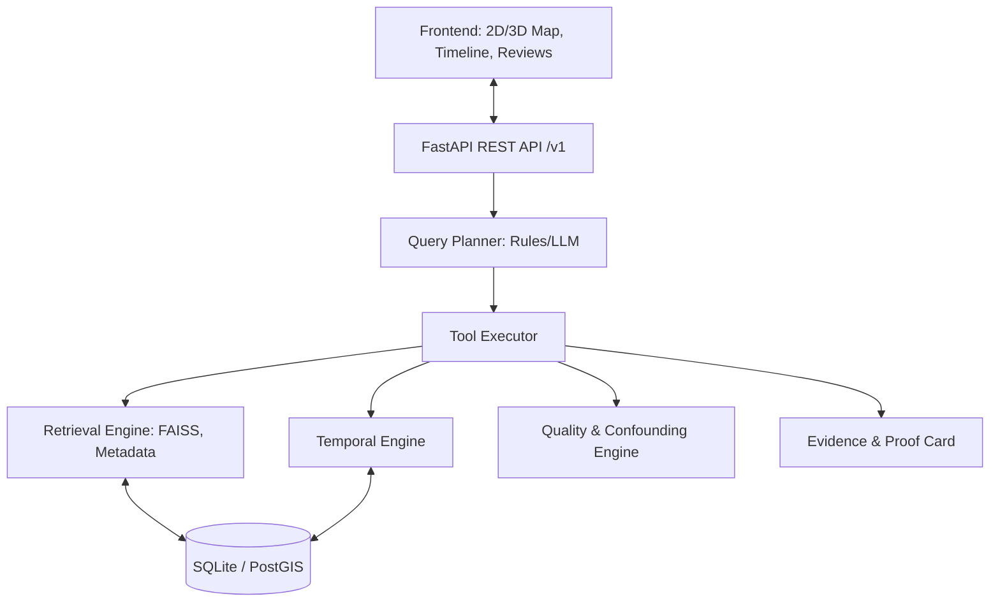

# System Architecture

## Overview
GeoSentinel AI follows a modular, plugin-based architecture designed for offline, air-gapped environments.

## Plugin Registry
Every module (embedding, vector store, change detector, llm, map) registers via a plugin system to allow easy swapping and graceful degradation.

## Modularity
- **Interfaces**: Defined in `geosentinel/core/schemas.py`.
- **Config-Driven**: `features.yaml` flags control feature availability (e.g., `semantic_search: true`).

## Key Components
- **API**: Versioned `/v1` endpoints.
- **Data Stores**: SQLite (MVP) or PostgreSQL+PostGIS for relational data, FAISS or Qdrant for vectors.
- **Offline Assurance**: Network calls strictly blocked at runtime.
